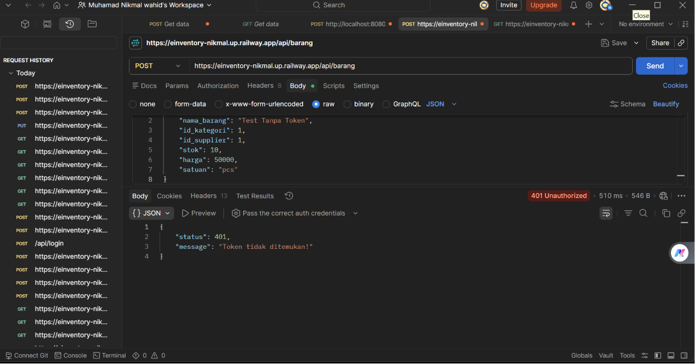
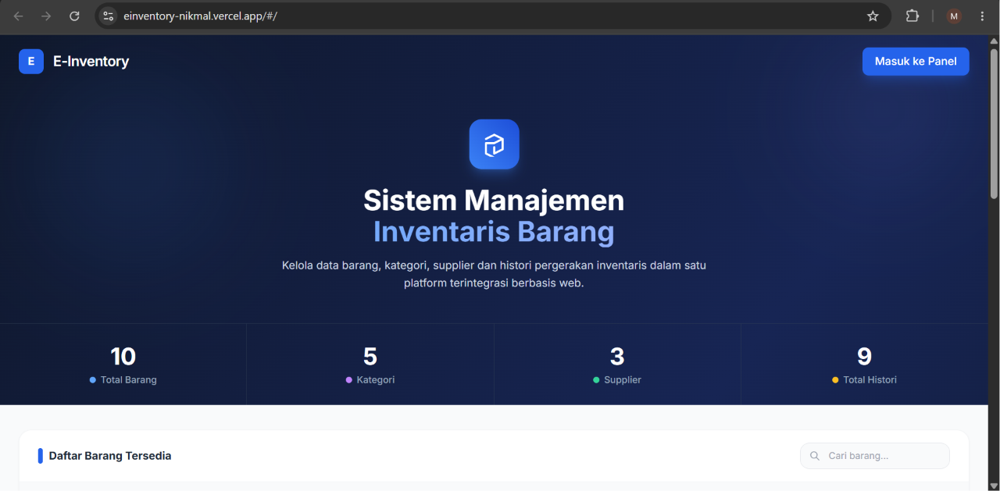
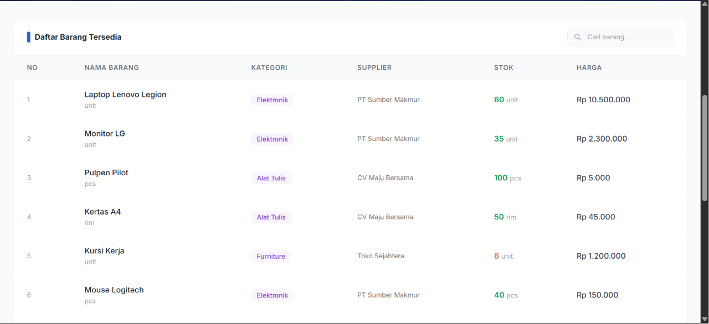
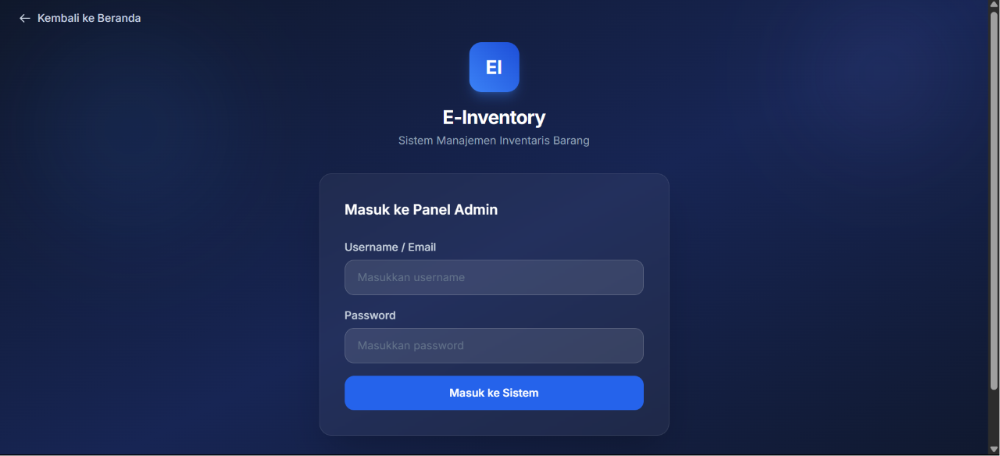
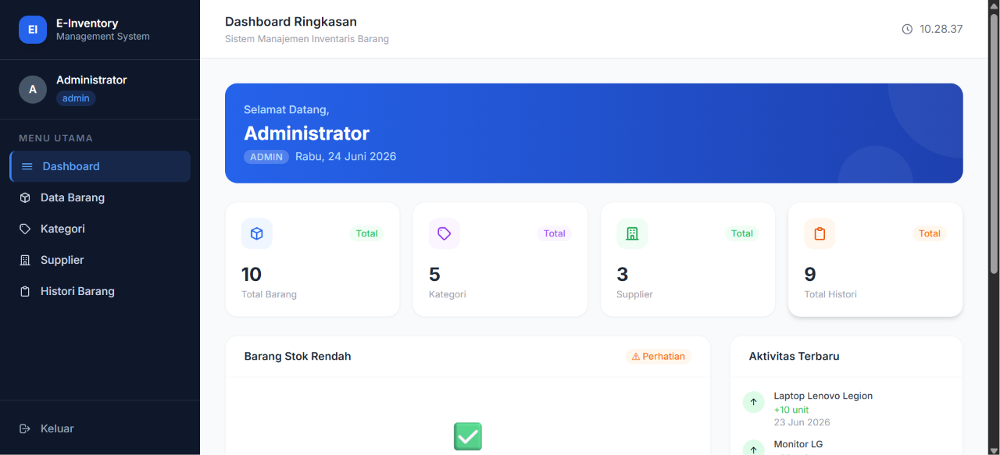
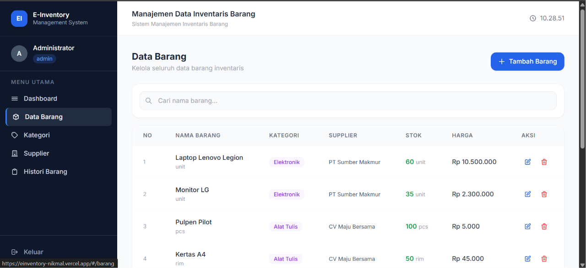
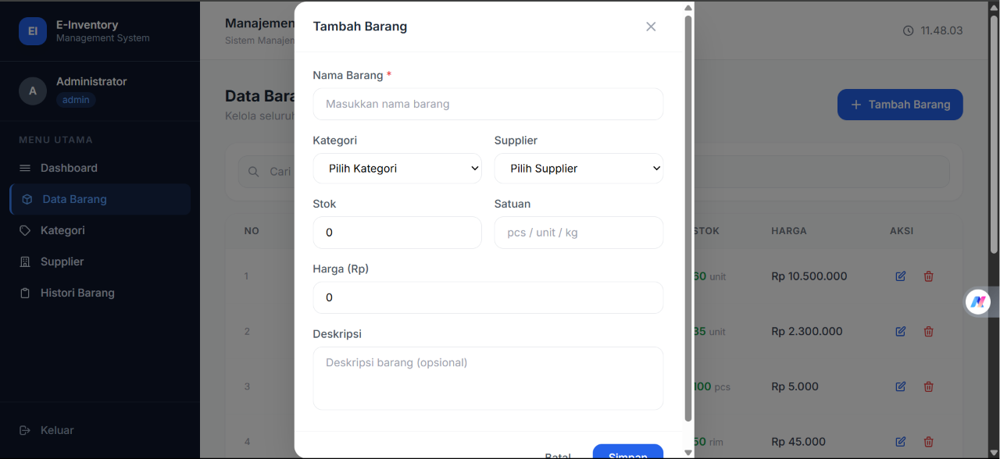
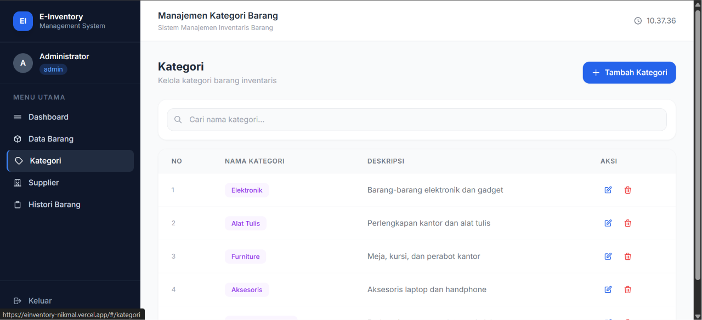
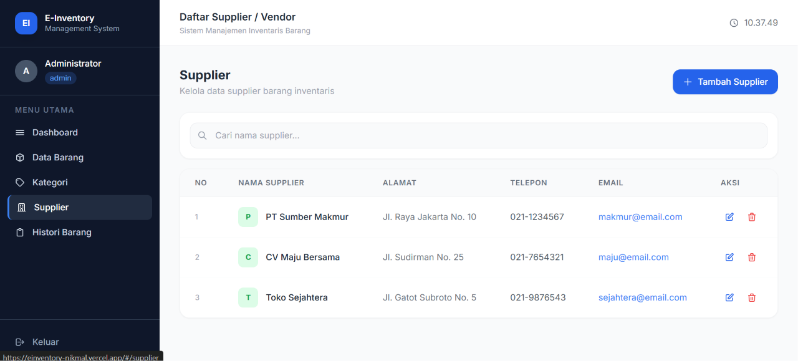
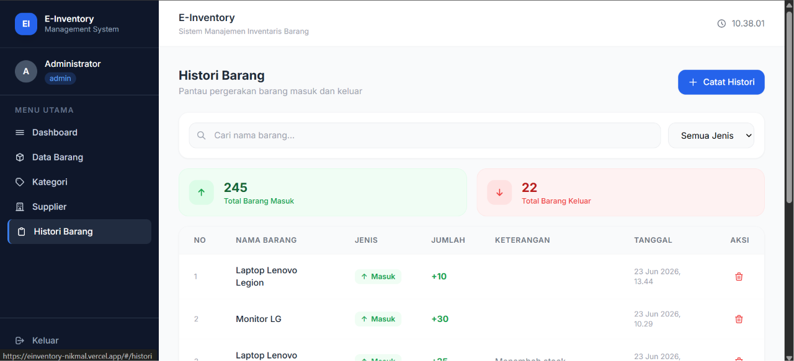

#  E-Inventory System
### Sistem Manajemen Inventaris Barang

> Proyek Ujian Akhir Semester (UAS) — Mata Kuliah Pemrograman Web 2

---

##  Deskripsi Proyek

**E-Inventory System** adalah aplikasi web manajemen inventaris barang berbasis arsitektur **Decoupled (Frontend & Backend terpisah)**. Aplikasi ini memungkinkan pengelolaan data barang, kategori, supplier, dan histori pergerakan stok barang masuk/keluar secara efisien dan real-time.

### Teknologi yang Digunakan

| Layer | Teknologi |
|-------|-----------|
| **Backend** | PHP Framework CodeIgniter 4 (RESTful API) |
| **Frontend** | VueJS 3 + Vue Router 4 (Single Page Application) |
| **UI Framework** | TailwindCSS via CDN |
| **HTTP Client** | Axios |
| **Database** | MySQL |

---

##  Skema Relasi Database

**Nama Database:** `uas_inventory`

### Relasi Antar Tabel

```
kategori ──┐
           ├──→ barang ──→ histori
supplier ──┘

users (autentikasi login)
```

### Screenshot Skema Database (phpMyAdmin Designer)


---

##  Pengujian Keamanan API — Error 401 Unauthorized

Endpoint manipulasi data (POST, PUT, DELETE) diproteksi menggunakan **Token-Based Authentication**. Request tanpa token akan ditolak server dengan respon **HTTP 401 Unauthorized**.

### Bukti Pengujian via Postman



**Endpoint yang diproteksi (wajib token):**
- `POST /api/barang`, `PUT /api/barang/:id`, `DELETE /api/barang/:id`
- `POST /api/kategori`, `PUT /api/kategori/:id`, `DELETE /api/kategori/:id`
- `POST /api/supplier`, `PUT /api/supplier/:id`, `DELETE /api/supplier/:id`
- `POST /api/histori`, `DELETE /api/histori/:id`

**Endpoint publik (tanpa token):**
- `GET /api/barang`, `GET /api/kategori`, `GET /api/supplier`, `GET /api/histori`
- `POST /api/login`

---

## Screenshot Antarmuka Aplikasi

### Halaman Beranda (Public)
Dapat diakses tanpa login. Menampilkan hero section, statistik total data, dan tabel daftar barang.





### Halaman Login
Form autentikasi untuk masuk ke panel admin.



### Dashboard Admin
Menampilkan ringkasan statistik, barang dengan stok rendah, dan aktivitas terbaru.



### Halaman Data Barang
Tabel data barang dengan fitur pencarian dan indikator warna stok.



### Modal Tambah / Edit Data
Form input interaktif dalam modal box untuk menambah dan mengedit data.



### Halaman Kategori



### Halaman Supplier



### Halaman Histori Barang
Mencatat pergerakan barang masuk/keluar dengan pembaruan stok otomatis.



---

##  Petunjuk Instalasi

### Prasyarat
- XAMPP (PHP 8.x + MySQL)
- Composer
- Web Browser
- VSCode + Live Server Extension

---

### 1. Setup Backend (CodeIgniter 4)

Masuk ke folder backend:

```bash
cd backend-api
```

Install dependencies:

```bash
composer install
```

Salin file environment:

```bash
cp env .env
```

Edit file `.env`:

```env
CI_ENVIRONMENT = development
app.baseURL = 'http://localhost:8080/'

database.default.hostname = localhost
database.default.database = uas_inventory
database.default.username = root
database.default.password =
database.default.DBDriver = MySQLi
database.default.port     = 3306
```

Buat database `uas_inventory` di phpMyAdmin, lalu import SQL tabel dan data dummy.

Jalankan server:

```bash
php spark serve
```

Backend berjalan di: `http://localhost:8080`

---

### 2. Setup Frontend (VueJS SPA)

Masuk ke folder frontend:

```bash
cd frontend-spa
```

Pastikan `apiUrl` di `assets/js/app.js` sesuai:

```javascript
const apiUrl = 'http://localhost:8080';
```

Jalankan dengan **VSCode Live Server** — klik kanan `index.html` → **Open with Live Server**

Akses di: `http://127.0.0.1:5500/index.html`

---

### 3. Akun Default

| Username | Password | Role |
|----------|----------|------|
| `admin` | `password` | Admin (full akses CRUD) |
| `staff` | `password` | Staff (hanya lihat data) |

---

##  Struktur Folder

```
UAS_Web2_NIM_Nama/
├── backend-api/                    ← CodeIgniter 4
│   ├── app/
│   │   ├── Config/
│   │   │   ├── Filters.php         ← CORS + apiauth filter
│   │   │   └── Routes.php          ← Semua route API
│   │   ├── Controllers/
│   │   │   └── Api/
│   │   │       ├── Auth.php        ← Login endpoint
│   │   │       ├── Barang.php      ← CRUD barang
│   │   │       ├── Kategori.php    ← CRUD kategori
│   │   │       ├── Supplier.php    ← CRUD supplier
│   │   │       └── Histori.php     ← CRUD histori + update stok
│   │   ├── Filters/
│   │   │   └── ApiAuthFilter.php   ← Token authentication
│   │   └── Models/
│   │       ├── UserModel.php
│   │       ├── BarangModel.php
│   │       ├── KategoriModel.php
│   │       ├── SupplierModel.php
│   │       └── HistoriModel.php
│   └── .env
│
└── frontend-spa/                   ← VueJS SPA
    ├── index.html                  ← Entry point + layout
    └── assets/
        └── js/
            ├── app.js              ← Router + Interceptors + Guards
            └── components/
                ├── Home.js         ← Landing page publik
                ├── Login.js        ← Form autentikasi
                ├── Dashboard.js    ← Panel utama admin
                ├── Barang.js       ← Manajemen barang
                ├── Kategori.js     ← Manajemen kategori
                ├── Supplier.js     ← Manajemen supplier
                └── Histori.js      ← Histori pergerakan barang
```

---

##  Fitur Aplikasi

### Public (Tanpa Login)
- Melihat landing page dengan informasi sistem
- Melihat statistik total data (barang, kategori, supplier, histori)
- Melihat daftar barang beserta harga dan stok

### Admin (Setelah Login)
- **Dashboard** — Statistik lengkap, monitoring stok rendah, aktivitas terbaru
- **Data Barang** — CRUD dengan pencarian dan indikator stok warna
- **Kategori** — CRUD kategori barang
- **Supplier** — CRUD data supplier/vendor
- **Histori** — Pencatatan barang masuk/keluar + update stok otomatis

### Staff (Setelah Login)
- Dapat mengakses semua halaman
- Hanya dapat melihat data (tombol CRUD disembunyikan)

### Keamanan
- **Server-Side:** CI4 Filter memproteksi endpoint dengan Bearer Token (401 jika tidak ada token)
- **Client-Side:** Vue Router Navigation Guard mencegah akses halaman tanpa login
- **Axios Interceptors:** Token otomatis disuntikkan ke setiap request keluar
- **Auto Logout:** Sesi otomatis berakhir dan redirect ke login jika token invalid

---

## 🔗 Link

| | Link |
|--|------|
|  **Video Presentasi** | [YouTube](https://youtu.be/DrnvZKxdojU) |
|  **Demo APlikasi** | [Link Demo](https://einventory-nikmal.vercel.app/#/) |

---

##  Identitas Mahasiswa

| | |
|--|--|
| **Nama** | Muhamad Nikmal Wahid |
| **NIM** | 312410372 |
| **Kelas** | I241C |
| **Mata Kuliah** | Pemrograman Web 2 |

---

*E-Inventory System — UAS Pemrograman Web 2*
